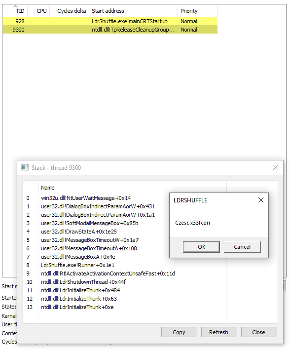
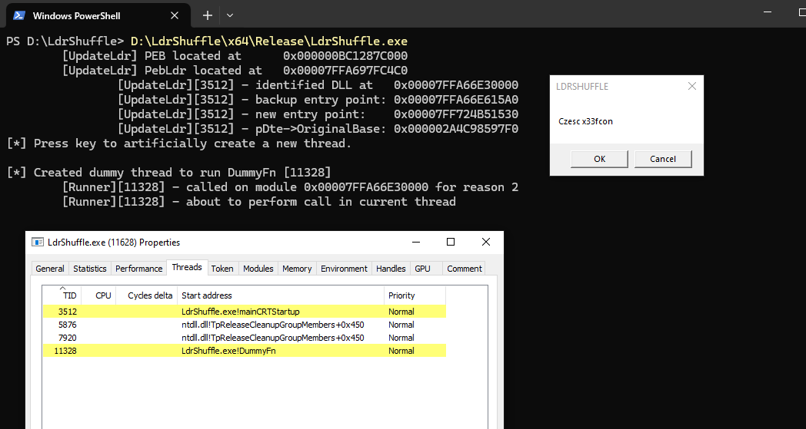

# LdrShuffle

Stealthy code execution via modification of the `EntryPoint` of loaded modules at runtime.

## Summary 

Windows processses have various modules loaded at runtime. Each of theses modules has a `DllMain()` function defined, which will be invoked on process or thread creation/destruction (four possible scenarios).

In order to properly call those functions during the lifetime of the process, the Windows Loader functions (`ntdll!Ldrp*`) will refer to a list of entries containing key parameters (including the `EntryPoint` field) for each module.

By overwriting this `EntryPoint` for a DLL, we ensure that code execution will be redirected to a place of our choosing.

## Use Cases 

This can be used both as a code execution primitive, and for API proxying, ie. in order to run certain APIs with a non-suspicious callstack since they will be invoked by legitimate Windows functions.

This can also be used to trigger execution in a remote process, provided the attacker has the ability to read and write memory on this target process. Similarly to the [Threadless Injection](https://github.com/CCob/ThreadlessInject), this provides the ability to execute code in a process without invoking classic APIs related to execution (`CreateRemoteThread`, `QueueUserAPC`)

## Challenges

The modules loading/unloading within a Windows process is a complex subject which presents a lot of challenges, potential for instability, race conditions, and crashes. A well-known hurdle related to running code as part of a `DllMain()` function for instance, lies in the fact that a Loader Lock is in place and that we are running in a thread which has not been completely setup, or which is in the process of being terminated.

Therefore, I have tried to document properly what is possible and what is not. For instance, while most of the usual API calls can be performed, running a full-fledged beacon comes with certain requirements to be in a separate process, in order to avoid deadlocks caused by the functions used in `wininet.dll` or `winhttp.dll`.

# Implementation

## Refresher on DLL Loading in Windows

Each process maintains a list of _LDR_DATA_TABLE_ENTRY structures at runtime. Those structures contain many details relevant to the DLL, such as its `EntryPoint` (which we will overwrite), its name, certain hashes, timestamps, various flags, etc. Some of these structures are documented and some are not.

These can be visualized through this WinDbg command:

`dt nt!_LDR_DATA_TABLE_ENTRY 0xdeadbeef`

```c
0:006> dt nt!_LDR_DATA_TABLE_ENTRY 0x18d1c4838c0
ntdll!_LDR_DATA_TABLE_ENTRY
   +0x000 InLoadOrderLinks : _LIST_ENTRY [ 0x0000018d`1c485de0 - 0x0000018d`1c4832b0 ]
   +0x010 InMemoryOrderLinks : _LIST_ENTRY [ 0x0000018d`1c485df0 - 0x0000018d`1c4832c0 ]
   +0x020 InInitializationOrderLinks : _LIST_ENTRY [ 0x0000018d`1c4832d0 - 0x0000018d`1c482c80 ]
   +0x030 DllBase          : 0x00007ffe`e87e0000 Void
   +0x038 EntryPoint       : 0x00007ffe`e8838d00 Void
   +0x040 SizeOfImage      : 0x2fe000
   +0x048 FullDllName      : _UNICODE_STRING "C:\WINDOWS\System32\KERNELBASE.dll"
   +0x058 BaseDllName      : _UNICODE_STRING "KERNELBASE.dll"
   +0x068 FlagGroup        : [4]  "???"
   +0x068 Flags            : 0x8a2cc
   +0x068 PackagedBinary   : 0y0
   +0x068 MarkedForRemoval : 0y0
   +0x068 ImageDll         : 0y1
(...)
   +0x0e0 MappingInfoIndexNode : _RTL_BALANCED_NODE
   +0x0f8 OriginalBase     : 0x00007ffe`e87e0000
   +0x100 LoadTime         : _LARGE_INTEGER 0x01db5f86`2fa735fc
   +0x108 BaseNameHashValue : 0x235bec4
   +0x10c LoadReason       : 0 ( LoadReasonStaticDependency )
   +0x110 ImplicitPathOptions : 0x4000
   +0x114 ReferenceCount   : 1
   +0x118 DependentLoadFlags : 0x800
   +0x11c SigningLevel     : 0 ''
```

The address of the structure can be obtained by walking a doubly-link structure referenced in the process PEB in a PEB_LDR_DATA structure.

`dt nt!_PEB_LDR_DATA 0xb4b4c3c3`

Note the `DontCallForThreads` flag. As the name indicates, if that flag is set, the OS will NOT call the `DllMain()` of that module for thread events (ie. `DLL_THREAD_ATTACH` or `DLL_THREAD_DETACH`).

When creating a DLL, the following template has to be followed in order to work hand in hand with the OS Loader functions:

```c
BOOL WINAPI DllMain(
    HINSTANCE hinstDLL,  // handle to DLL module
    DWORD fdwReason,     // reason for calling function
    LPVOID lpvReserved )  // reserved
{
    // Perform actions based on the reason for calling.
    switch( fdwReason ) 
    { 
        case DLL_PROCESS_ATTACH:
         // Initialize once for each new process.
         // Return FALSE to fail DLL load.
            break;

        case DLL_THREAD_ATTACH:
         // Do thread-specific initialization.
            break;

        case DLL_THREAD_DETACH:
         // Do thread-specific cleanup.
            break;

        case DLL_PROCESS_DETACH:
        
            if (lpvReserved != nullptr)
            {
                break; // do not do cleanup if process termination scenario
            }
            
         // Perform any necessary cleanup.
            break;
    }
    return TRUE;  // Successful DLL_PROCESS_ATTACH.
}
```

## Technical Details on the Implementation

### Setting Up an API Call

As outlined above, the technique temporary overwrite the `EntryPoint` of a DLL in order to redirect execution. Since we have no control over anything more than the redirection of the execution, some arrangements have to be made on the side to handle what we want to run, with what arguments, and how to get the return value back.

This is done by defining a `DATA_T` structure on the heap, in such a way that it will remain accessible throughout the various steps.

That structure is defined as follows:

```c
typedef struct _DATA_T {
    // LDR structures manipulation
    ULONG_PTR   runner;             // malicious entry point to execute
    ULONG_PTR   bakOriginalBase;    // backup of overwritten OriginalBase
    ULONG_PTR   bakEntryPoint;      // backup of overwritten EntryPoint
    HANDLE      event;              // event signalling that the Runner has executed
    // function call
    ULONG_PTR   ret;                // return value
    DWORD       createThread;       // run this API call in a new thread (required for wininet/winhttp)
    ULONG_PTR   function;           // Windows API to call
    DWORD       dwArgs;             // number of args
    ULONG_PTR   args[MAX_ARGS];     // array of args
} DATA_T, * PDATA_T;
```

To setup an API execution, these fields have to be prepared. the `ret` value is the one which will collect the return value after execution. The `event` is used for synchronization, to signal that the execution has been completed. All the other fields are inputs defining what API to call (`function`), with which arugments (`dwArgs` and `args[]`), the address of the `Runner()` function where execution is redirected, and backups of the overwritten original DLL entries (`bakOriginalBase` and `bakEntryPoint`).

The `createThread` field needs to be set to 1 for those complex API functions which won't run well in a `DllMain()` setup (this includes many `wininet` and `winhttp` libraries).

Here is an example setting up a call to `MessageBoxA()` as visible in the PoC:

```c
 pDataT->dwArgs = 4;
 pDataT->runner = (ULONG_PTR)Runner;
 pDataT->function = (ULONG_PTR)MessageBoxA;
 pDataT->args[0] = (ULONG_PTR)0;
 pDataT->args[1] = (ULONG_PTR)"Hello";
 pDataT->args[2] = (ULONG_PTR)"LDRSHUFFLE";
 pDataT->args[3] = (ULONG_PTR)MB_OKCANCEL;
 pDataT->event = CreateEventA(NULL, FALSE, FALSE, "ExecEvt");
```

### Modifying the _LDR_DATA_TABLE_ENTRY

The `UpdateLdr()` function is responsible for performing the right modification in the target module's `_LDR_DATA_TABLE_ENTRY`.

`RestoreLdr()` will restore those changes at a later stage (invoked by `Runner()`).

These functions essentially locate the PEB and walk the module structures to identify the right DLL and its fields. In the header files, I am reusing definitions used by Batsec in his [DarkLoadLibrary](https://github.com/bats3c/DarkLoadLibrary) and I would encourage readers to check this project and [the associated MDSec blogpost](https://www.mdsec.co.uk/2021/06/bypassing-image-load-kernel-callbacks/) to benefit from the great work he has been doing on the internals of module loading in Windows.

Note: this PoC loads a sacrificial DLL (`SACRIFICIAL_DLL_NAME`) and performs those changes on this DLL. However, it is perfectly doable to amend an already loaded DLL. This is in fact the approach taken for cross-process injection. For stability purposes, I would recommend to avoid touching important DLL likes `ntdll` or `kernel32`, which also tend to be more scrutinized by security solutions.

### Execution

Upon thread creation or destruction, the execution is redirected to `Runner()`, which acts as a fake `DllMain()` for the module. This function will then:

- locate on the heap where the data structure used to run calls/get return value is (`PDATA_T` structure)
- restore the PEB `RestoreLdr()` to its original state
- perform the normal `DllMain()` call (essentially proxying the normal DLL call).

At this point, the "normal" OS execution has been performed. It then continues with our payloads:

- execute our malicious API call, as per the values and arguments stored on `DATA_T` structure. If this API has been marked to run in a new thread (`createThread = 1`) this call will be performed in a new thread.
- finally, signal an event (`pDataT->event`) so that our main code knows the call has been performed.

When Windows ends up invoking our fake `EntryPoint` (which is the `Runner()` function address), the callstack looks as follows:




## API Proxying Example

The provided PoC contains an example invoking `MessageBoxA()`.

It also contains a demonstration of an HTTP download using `wininet`. Define the `HTTP` variable to enable that code.



## Cross-Process Injection Example

The principles outlined above boil down to reading and writing in the process memory space, in order to cause code execution at an arbitrary point in time in the future.

With a few tweaks, these read and write operations can be applied to a remote process in order to overwrite one of its DLL's `EntryPoint`.

A pre-requisite is the ability to read and write in the process memory space, ie:

`OpenProcess(PROCESS_VM_READ, FALSE, dwPid)` and `OpenProcess(PROCESS_VM_WRITE | PROCESS_VM_OPERATION, FALSE, PID)`

An extra project is present in the PoC, called `LdrInject`, demonstrating how to perform these steps. In a nutshell, it does the following:

- in `ReadPEB()`, it walks the `_LDR_DATA_TABLE_ENTRY` list in the target process to identify a suitable DLL to overwrite. Note that this DLL must have `DontCallForThreads == 0` because we wan't Windows to invoke that DLL's `EntryPoint` on thread creation. We are also not picking the first DLLs in the list as they tend to be more scrutinized by security products (`ntdll.dll`, `kernel32.dll`...).

- the details for that DLL are stored in a `PEBINJ_DATA` data structure.

- shellcode (in this case a beacon) is written in the remote processspace with `InjectShellcodeToRemoteProcess()`

- two `WriteProcessMemory()` calls overwrite the DLL's `EntryPoint` and back it up into `OriginalBase` so that it can later be restored.

At that point, the next `DLL_THREAD_ATTACH` or `DLL_THREAD_DETACH` event will result in the shellcode being invoked. This comes with certain limitations and caveats in the context of running a beacon, which are detailed in the next section.

# Cobalt Strike Beacon

This technique results in the execution of a shellcode in a very specific situation. The Loader Lock is active (since the OS believes it is in the process of loading/unloading a DLL); a thread is either being created or destructed; and generally speaking, there is potential for thread synchronization issues, deadlocks, etc.

During testing, two challenges have been observed:

- running a typical Cobalt Strike beacon would result in a deadlock when using APIs in `wininet.dll` or `winhttp.dll`. 

- running on thread destruction causes stability issues since we are running in a thread which is in the process of being destroyed.

To increase stability, we have to:

- make sure the beacon will run in a new thread. Therefore, the UDRL will `CreateThread` before invoking the usual Cobalt Strike reflective DLL entry point.

- only run in a thread being created and not a dying one. To do this, we ensure that when `EntryPoint` is called by the OS, the reason invoked is `fdwReason == DLL_THREAD_ATTACH`:

`winApi.CreateThread(NULL, 4096, (LPTHREAD_START_ROUTINE)&runner, (LPVOID)&ct_data, 0, &dwThId);`

instead of the usual

`((DLLMAIN)entryPoint)((HINSTANCE)loaderStart, 4, NULL);`

```c
    ULONG_PTR __cdecl ReflectiveLoader(HINSTANCE hinstDLL, DWORD fdwReason, LPVOID lpvReserved) {
        // only run for a Thread creation event
        
        if (fdwReason != DLL_THREAD_ATTACH) {
            return TRUE;
        }

        ...
    }
```

These two extra-steps have been embedded in a demo for a UDRL.

# Testing

## List of APIs Tested for LdrShuffle

`VirtualAlloc`

`VirtualProtect`

`CreateThread`

`Sleep`

`MessageBoxA`

`InternetOpenW` (needs to run with `createThread = 1`)

`InternetOpenUrlA` (needs to run with `createThread = 1`)

# TODO

- Continue testing more APIs for the LdrShuffle


